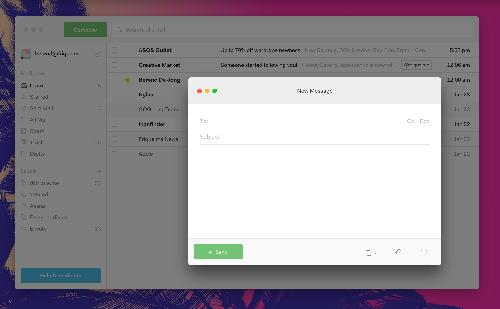

This theme has been tested on OSX 10.10.5, in N1 version 0.4.10.
Note that the screenshot is of theme version 1.0.

### Instructions
- [Install N1](https://www.nylas.com/n1)
- [Download the theme](https://github.com/Frique/N1-Berend/releases)
- Select "Install Theme..." from the menus and point to the downloaded folder
- It is advised to restart N1 to avoid visual glitches after switching theme

### Issues
- Check back here if your issue has been fixed in the newest version
- Open a github issue

### Todo
- Test on Windows
- Test on Linux
- Responsive tweaks: Narrower sidebar width
- ~~Styling changes when window is not focused~~
- ~~Account list item hover style~~
- RTL support
- Style popovers
- Style dropdowns
- Better utilization of the global variables
- Better thread list padding when the core allows styling it with CSS
- ~~Add padding to the bottom of the sidebar to accommodate for the feedback button~~
- ~~Fix styling of combined collapsed messages in a long thread~~
- ~~Fix height of text format tooltip~~
- ~~Fix focused thread highlighting during keyboard navigation~~
- ~~N1 0.4.4 compatibility~~
- ~~Fix the unified inbox sidebar sub-items not showing numbers~~
